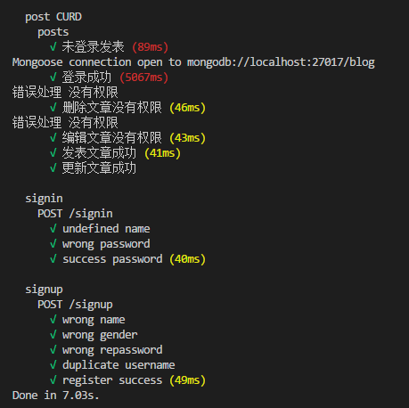
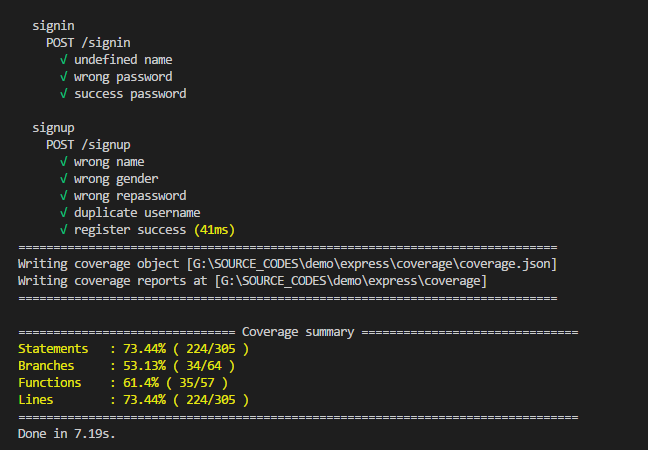

## 基于express的博客

### 使用
  - 数据库使用MongoDB、框架使用express、模板引擎ejs
  - 开启数据库服务
  - yarn install
  - yarn start

## 效果
  - mocha 测试

    

  - istanbul 覆盖测试

    

  - 实际效果

    

## 优化

  - 经测试发现，第一次登陆时间过长
  - 可能是数据库设计问题，评论是存储，通过promise.all回调使用
  - 后续改进
